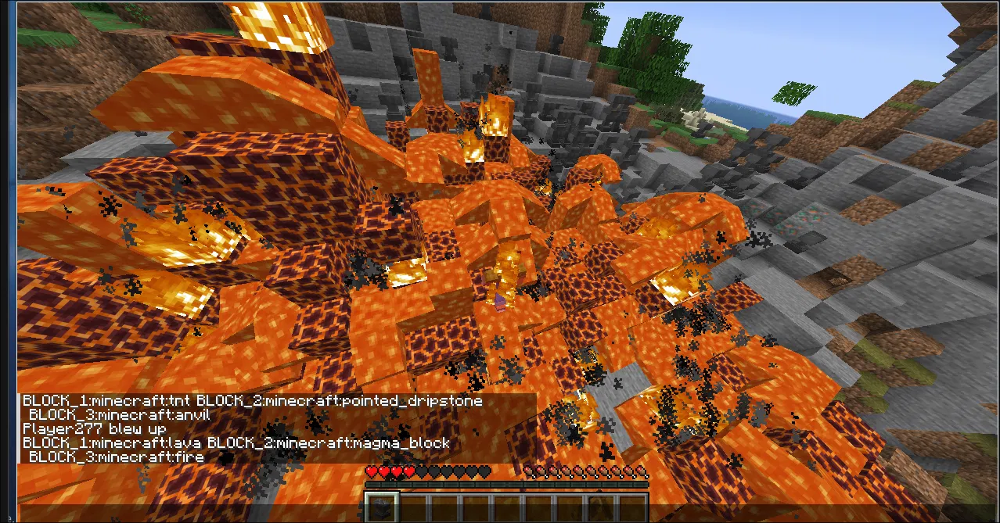
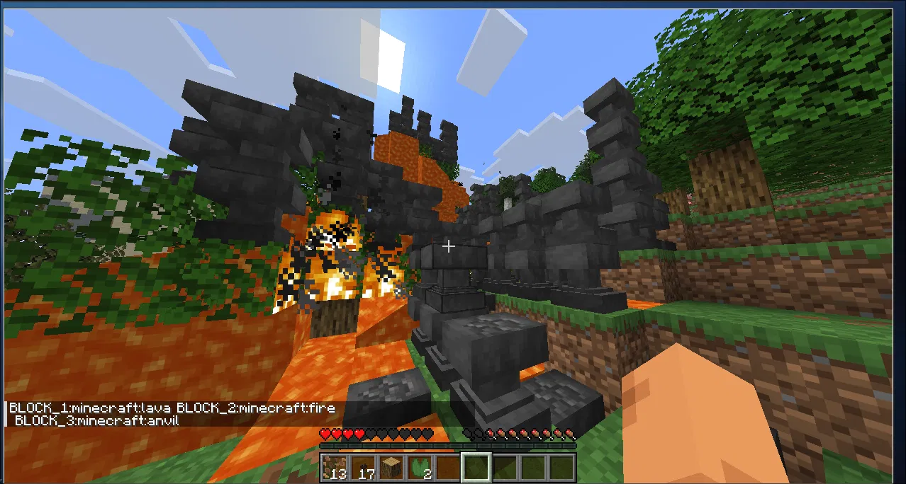

### SURVIVE THE ROGUE AI 🤖
This is survive the AI, it uses API calls to ask a AI how it would like to kill you today, and oh god does it really want to kill you.

## In case you don't believe me :sob:




# OH NO
So as you can see from the images above, this AI is armed and dangerous.

## How it works
Well first, it starts pretty simple. every 15seconds, it summons the api (it sounds quick but the api calls are cheap and semi-slow) we give the AI a list of blocks, and the API returns json, I used Gson from google to parse it, and split it up, then I proceeded to process the string to make it a real Block. I proceed to split a random area from the 3 blocks, and if its tnt KABOOM summon primed tnt, If its a falling block, it is placed 20 blocks above!

#### VERSION SPECIFICATIONS
Built for Fabric Loader 0.19.3, Fabric API 0.154.1+26.2, Java 25, Minecraft 26.2.
The mod runs server-side logic, but it still works in singleplayer thanks to Minecraft's integrated server.

## How to use
There's only one thing you need to make sure of: you MUST put your API key in a file called `secrets.properties`, located at `<project root>/run/secrets.properties`. The file should contain one line:
```
key=ourkeyhere
```
You can get a free API key from https://ai.hackclub.com/dashboard.
BTW HACKAI is only for people verified in hackclub's ecosystem (https://identity.hackclub.com)